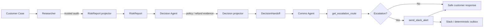

# GlobalCart Multi-Agent Operations Crew

**Place IL Quest 4 — Stage 2**  
Stage 1 remains intact as the single-agent baseline; Stage 2 adds a capability-separated three-agent crew, typed handoffs, deterministic guardrails, external escalation, and an interactive execution-trace demo.

> **Probabilistic intelligence, deterministic guardrails.**  
> The LLM chooses the next useful action. Python controls authority. Supplied tools determine business truth.

## What Stage 2 adds

GlobalCart now resolves customer-operations cases through three real specialists:

| Agent | Responsibility | Tools it can physically access | Trusted handoff |
| --- | --- | --- | --- |
| **Researcher & Fraud Auditor** | Verify the case and investigate fraud risk | `get_order_details`, `get_user_profile`, `audit_fraud_risk` | `RiskReport` |
| **Decision Maker / Ops Lead** | Evaluate return policy and refund authority | `check_return_policy`, `process_refund` | `DecisionHandoff` |
| **Communications & Escalation** | Resolve escalation route and external alert | `get_escalation_route`, `send_slack_alert` | `CommunicationResult` |

The agents do **not** share one giant chat history. Each receives its own prompt, its own working memory, only its role-specific tools, and a strict Pydantic handoff from the previous stage.

## Architecture



There is intentionally **no supervisor LLM** and no LangGraph dependency. The specialist order is known in advance, so a small deterministic `GlobalCartCrew` orchestrator is easier to audit and cheaper to run. The agents remain autonomous *inside* their authority boundary: they choose which allowed tool to call and when, while Python prevents unsafe or unsupported transitions.

### The core ownership rule

```text
LLM              -> chooses actions inside its role
Python runtime   -> executes, bounds and validates those actions
Supplied tools   -> determine policy, fraud, refund and routing truth
Projectors       -> convert trusted evidence into typed handoffs
Presentation     -> exposes only safe terminal facts and execution trace
```

No order ID is special-cased. `ORD-1005` and `ORD-1012` both escalate because the generic supplied fraud audit returns `blocks_automatic_refund=true`, even though different fraud rules fired.

## Authority and guardrails

These are enforced in code, not merely requested in prompts:

- **Capability separation:** each specialist receives only its official tool bundle. Researcher and Comms cannot refund; Decision cannot send alerts.
- **Grounded identifiers:** the Researcher cannot silently invent or switch order IDs. If the customer explicitly supplies a user ID, that claim is preserved through verification rather than silently replaced with another user.
- **Evidence-complete research:** the Researcher cannot finish successfully before a real fraud-audit result or terminal business error exists. The runtime can reject premature completion without telling the model which tool to choose next.
- **Fraud authority:** `blocks_automatic_refund=true` prevents `process_refund` from executing.
- **Policy precondition:** a refund requires trusted `check_return_policy -> eligible=true` evidence for the same order.
- **No refund splitting:** only one refund attempt is allowed, and its amount must match the grounded requested amount.
- **No fabricated approval:** only `process_refund(status=APPROVED)` proves money moved.
- **Trusted routing:** normal Slack alerts require a trusted escalation route; channel and severity must match that route.
- **Identity mismatch:** `USER_ORDER_MISMATCH` is terminal, never retried with a different customer, never reaches the Decision agent, and goes to security review.
- **Missing order:** `ORDER_NOT_FOUND` asks the customer to verify the order number instead of guessing another ID.
- **Customer privacy:** fraud score, triggered rules and accusations never enter customer-facing wording.
- **Bounded execution:** per-agent max steps, no-progress detection, retry bounds and fail-safe termination prevent loops.

See [`docs/STAGE2_ARCHITECTURE.md`](docs/STAGE2_ARCHITECTURE.md) for the full boundary design.

## Interactive frontend demo

Stage 2 includes a lightweight FastAPI + vanilla HTML/CSS/JS demo. It runs the **same `GlobalCartCrew` runtime as the CLI** — there is no duplicate demo business logic.

The UI provides:

- a **Start conversation** experience;
- predefined scenarios for the important Quest cases;
- a free-form customer case input;
- a visual `Researcher -> Decision -> Comms` pipeline;
- `RiskReport` and `DecisionHandoff` cards;
- every observable tool call and its trusted result;
- visible guardrail blocks and terminal errors;
- final customer response and escalation status.

The execution panel intentionally does **not** expose private model chain-of-thought. It shows auditable system behavior: tool selection, arguments, trusted observations, guardrails and structured handoffs.

Run it locally:

```bash
python web_app.py
```

Then open:

```text
http://127.0.0.1:8000
```

This is the recommended interface for the Loom demo because the agent separation and handoffs are visible without reading terminal JSON.

## Critical live scenarios

### 1. Clean refund — `ORD-1001`

```text
Researcher -> risk 0 / low
Decision   -> policy ELIGIBLE -> process_refund once -> APPROVED 35 USD
Comms      -> no escalation
Result     -> refund approved; no Slack alert
```

### 2. High-risk damaged item — `ORD-1005`

```text
Researcher -> risk 90 / high -> blocks automatic refund
Decision   -> policy may be ELIGIBLE, but process_refund is not executed
Comms      -> CH-FRAUD / critical -> alert
Result     -> additional review; no refund issued
```

### 3. Different high-risk path — `ORD-1012`

Different fraud rules produce risk `60/high`; the exact same generic high-risk guardrail blocks the 890 USD automatic refund and routes the case to security.

### 4. Identity mismatch

Customer claims `USR-101` for `ORD-1005`:

```text
get_order_details(ORD-1005)
get_user_profile(USR-101)
audit_fraud_risk(ORD-1005, USR-101) -> USER_ORDER_MISMATCH
Decision agent -> skipped
process_refund -> impossible
Comms -> security escalation
```

### 5. Unknown order

`ORD-9999` produces `ORDER_NOT_FOUND`; the crew stops and asks the customer to check the number. It does not probe nearby orders.

## Setup

Python 3.11+ is recommended.

```bash
python -m pip install -r requirements-dev.txt
```

Copy `.env.example` to `.env` and add the local model credential:

```dotenv
LLM_PROVIDER=openrouter
LLM_MODEL=qwen/qwen3.5-397b-a17b
OPENROUTER_API_KEY=your-local-secret
```

Bootstrap the supplied toolkits:

```bash
bash scripts/bootstrap_upstream.sh
bash scripts/bootstrap_stage2.sh
```

The Stage 2 bootstrap pins the official upstream commit and must finish with:

```text
All 51 checks passed. The crew's tool box is behaving as documented.
```

### Windows without working WSL/bash

The starter kit only needs to exist at the configured path. The equivalent PowerShell bootstrap is:

```powershell
$vendor = ".vendor/place-il-quests-stage2"
if (!(Test-Path "$vendor\.git")) {
    git clone --filter=blob:none --no-checkout https://github.com/liraz-place-il/Quests.git $vendor
}
git -C $vendor sparse-checkout init --cone
git -C $vendor sparse-checkout set "Quest 4/Stage 2"
git -C $vendor fetch --depth 1 origin 6f8efa381de7f0a18b947534ae6a1a762f2d3391
git -C $vendor checkout --detach 6f8efa381de7f0a18b947534ae6a1a762f2d3391
python "$vendor/Quest 4/Stage 2/starter-kit/examples/verify_scenarios.py"
```

## CLI

High-risk case:

```bash
python run_crew.py --verbose --message "This is USR-105, order ORD-1005. The tablet screen was smashed on arrival. Refund me the full 480 dollars."
```

Clean case:

```bash
python run_crew.py --verbose --message "Order ORD-1001 arrived damaged. Please refund 35 dollars."
```

Different high-risk case:

```bash
python run_crew.py --verbose --message "Order ORD-1012 arrived but the laptop was missing from the box. Please refund the full 890 dollars."
```

Identity mismatch:

```bash
python run_crew.py --verbose --message "I am USR-101 and I need a refund for order ORD-1005."
```

## Verification

Deterministic project gate:

```bash
python -m pytest tests -q
```

Official Stage 2 tool verifier:

```bash
python ".vendor/place-il-quests-stage2/Quest 4/Stage 2/starter-kit/examples/verify_scenarios.py"
```

CI also runs the pinned Stage 1 verifier as a regression gate, the full project test suite, and the Stage 1 eval dry-run. Stage 1 continues to work through `run_agent.py`.

## External escalation

`send_slack_alert` always writes the official deterministic outbox record. If `SLACK_WEBHOOK_URL` is configured in the supplied Stage 2 starter-kit environment, the same tool can also deliver to the real Slack integration required for the demo/submission.

The application never fabricates successful alert delivery; the returned tool result is the source of truth.

## Repository map

```text
app/
  crew/
    bootstrap.py       shared CLI/web construction
    config.py          Stage 2 runtime configuration
    contracts.py       typed RiskReport / Decision / Communication handoffs
    orchestrator.py    deterministic Researcher -> Decision -> Comms flow
    presentation.py    safe observable execution-trace projection
    projection.py      trusted evidence -> typed handoff projectors
    prompts.py         role instructions (not the security boundary)
    runtime.py         bounded specialist tool loop
    tools.py           role-scoped supplied tool adapters

web/
  index.html           interactive demo shell
  styles.css           responsive visual system
  app.js               scenarios, chat and execution-trace rendering

run_agent.py           Stage 1 baseline
run_crew.py            Stage 2 CLI
web_app.py             Stage 2 FastAPI demo server
```

## Design choices

### Why custom orchestration instead of LangGraph/CrewAI?

The Stage 2 workflow is a known sequential dependency chain. A framework would add another abstraction without improving the core authority model. The business-safe pieces are framework-independent: typed handoffs, tool ownership, projectors and guardrails.

If this grew into a production workflow with pause/resume, durable checkpoints, many conditional branches and human approval nodes, LangGraph would be a reasonable orchestration layer **around** these same agents. It should manage workflow, not become the source of business truth.

### Why not let the model write the final business outcome?

Because a model can be persuasive and still be wrong. The model selects actions; typed projectors derive the outcome from trusted tool evidence. This preserves autonomy without giving probabilistic text authority over money or security escalation.

## Documentation

- [`docs/STAGE2_ARCHITECTURE.md`](docs/STAGE2_ARCHITECTURE.md) — multi-agent architecture, memory and authority boundaries
- [`docs/IMPLEMENTATION_SPEC.md`](docs/IMPLEMENTATION_SPEC.md) — Stage 1 runtime contract
- [`docs/GUARDRAILS.md`](docs/GUARDRAILS.md) — deterministic safety principles
- [`docs/MODEL_SELECTION.md`](docs/MODEL_SELECTION.md) — provider/model selection evidence
- [`docs/VERIFICATION.md`](docs/VERIFICATION.md) — reproducible verification details
- [`docs/UPSTREAM.md`](docs/UPSTREAM.md) — pinned supplied starter-kit handling
