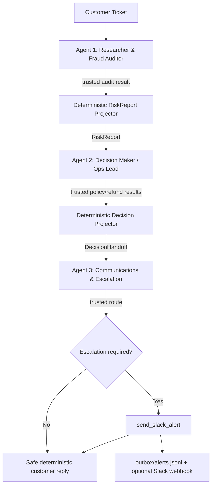

# Stage 2 — Multi-Agent Crew Architecture

## Design decision

Stage 2 extends the Stage 1 philosophy instead of replacing it with a framework:

> **The LLM decides what to do. Python decides what actually happened — at every agent boundary.**

The crew is intentionally sequential because each specialist depends on a trusted artifact from the previous stage:



There is no LLM supervisor. The order of specialists is known in advance, so a deterministic Python orchestrator is simpler, cheaper, and easier to audit.

## Autonomous behavior vs deterministic authority

Stage 2 does **not** hardcode business outcomes for individual orders.

The model still chooses which allowed tool to call and how to investigate inside its role. Python only enforces generic invariants such as:

- do not invent/swap identifiers;
- do not finish a required evidence stage prematurely;
- do not cross role capabilities;
- do not issue multiple refunds;
- do not execute a refund when trusted fraud evidence blocks it;
- do not claim a side effect happened unless the supplied tool confirms it.

The supplied tools remain the source of business truth. For example, `ORD-1005` and `ORD-1012` take the same high-risk path because the fraud tool returns the same generic authority signal (`blocks_automatic_refund=true`), not because their IDs appear in business rules owned by the application.

## Real agents, not three prompt templates

Each specialist has all four properties needed for a real authority boundary:

| Agent | Own prompt | Own working context | Tool capability | Trusted output |
|---|---|---|---|---|
| Researcher | `RESEARCHER_PROMPT` | customer ticket + its own tool observations | `RESEARCHER_TOOLS` only | `RiskReport` |
| Decision | `DECISION_PROMPT` | customer ticket + validated `RiskReport` | `DECISION_TOOLS` only | `DecisionHandoff` |
| Comms | `COMMS_PROMPT` | validated `DecisionHandoff` only | `COMMS_TOOLS` only | `CommunicationResult` |

Tool access is enforced by `RoleToolKit`, not by prompt text. A request for a tool outside the specialist bundle is blocked before the supplied registry is reached.

## Memory model

### Working memory

Every `SpecialistAgent.run()` creates a fresh message list containing only:

1. that specialist's system prompt;
2. its task/handoff input;
3. its own model tool-call messages;
4. its own trusted tool observations.

A specialist never receives another specialist's full model conversation.

### Handoff memory

Only strict Pydantic artifacts cross normal role boundaries:

```text
Researcher
   |
   | RiskReport
   v
Decision
   |
   | DecisionHandoff
   v
Comms
```

`RiskReport` is projected from the real `audit_fraud_risk` payload. The model cannot invent or downgrade the fraud score/band in the handoff.

`DecisionHandoff` is projected from the validated `RiskReport` plus real policy/refund results. Free-form model prose cannot turn an escalation into an approved refund.

### Long-term memory

Not implemented because the Quest does not require cross-run customer memory. A CLI/web case execution is independent. The frontend can display multiple messages for demonstration, but each submitted case launches a fresh crew execution.

## Guardrails and where they live

### 1. Capability separation — composition layer

`app/crew/tools.py` exposes three independent toolkits from the official Stage 2 bundles:

- Researcher: `get_order_details`, `get_user_profile`, `audit_fraud_risk`
- Decision: `check_return_policy`, `process_refund`
- Comms: `get_escalation_route`, `send_slack_alert`

The Comms agent physically has no refund capability.

### 2. Identifier grounding — Researcher boundary

The runtime prevents random identifier exploration:

- a claimed order ID cannot silently change;
- user lookup is allowed only after a verified order exists;
- if the customer explicitly supplied a user ID, that claimed identity must be preserved rather than silently replaced by the order owner;
- if no user ID was supplied, the verified order owner is the grounded user source;
- the fraud audit must target the verified order;
- `ORDER_NOT_FOUND` stops the case instead of probing alternate orders;
- `USER_ORDER_MISMATCH` is terminal and is never retried with another user.

This is important: Python is not deciding that a particular user/order pair is fraudulent. It preserves the customer's claim so the **supplied fraud tool** can return the authoritative `USER_ORDER_MISMATCH` business error.

### 3. Evidence-complete Researcher execution — specialist runtime

A model may occasionally try to stop early after only one lookup. The runtime does not turn that into a business result.

For the Researcher, successful completion requires either:

- a trusted `audit_fraud_risk` result; or
- a terminal business error such as `ORDER_NOT_FOUND` / `USER_ORDER_MISMATCH`.

If the model produces a no-tool response before this condition is met, the runtime can continue the bounded agent loop with a generic incomplete-evidence observation. It does **not** tell the model a scenario-specific answer or hardcode which next tool it must call.

### 4. Fraud authority — Decision boundary

A high-risk `RiskReport` with `blocks_automatic_refund=true` disables `process_refund` at runtime.

This is deliberately stronger than a prompt instruction. `ORD-1005` and `ORD-1012` are blocked because of the generic trusted field, not because their IDs are special-cased.

### 5. Refund splitting / repeated side effects — Decision boundary

Only one `process_refund` attempt is allowed per case. A second request is blocked with `REFUND_ATTEMPT_ALREADY_MADE`.

The attempted amount must match the grounded requested amount so a model cannot split/reduce a claim merely to fit an automatic authority cap.

### 6. Policy precondition — Decision boundary

`process_refund` requires a trusted `check_return_policy` result with `eligible=true` for the same order.

Eligibility is not equivalent to money movement. Only `process_refund(status=APPROVED)` establishes a successful refund.

### 7. Alert authority — Comms boundary

For normal Decision handoffs, `send_slack_alert` requires a prior trusted route with `escalation_required=true`.

The runtime verifies:

- channel ID equals the trusted route;
- severity equals the trusted route;
- order/user/risk/amount payload facts equal the `DecisionHandoff`;
- only one alert may be sent.

If the route says `escalation_required=false`, no alert is allowed.

A terminal `USER_ORDER_MISMATCH` is a pre-Decision identity-consistency failure. It takes the dedicated security-review path and never enters refund authority at all.

### 8. Fraud privacy — customer presentation boundary

Customer-facing terminal wording is rendered from trusted outcomes. Fraud score, triggered rules, prior flags and accusations are not copied from model prose.

High-risk wording remains neutral:

> Your request requires additional review. No refund has been issued yet.

### 9. Infinite-loop prevention — specialist runtime

Each specialist has:

- `CREW_AGENT_MAX_STEPS` hard ceiling;
- repeated-identical-call no-progress detection;
- deterministic evidence-completion/terminal conditions;
- bounded LLM retries;
- fail-safe outcome when a valid handoff cannot be constructed.

Missing/invalid handoffs are never solved by recursively rerunning an agent forever.

## Safe observable execution trace

`app/crew/presentation.py` projects a `CrewRun` into the web-demo payload.

The browser receives:

- specialist role/status;
- observable tool calls and arguments;
- compact trusted tool results;
- guardrail-block reasons;
- `RiskReport`;
- `DecisionHandoff`;
- `CommunicationResult`;
- final crew status.

It intentionally does **not** expose provider messages, hidden reasoning tokens, model chain-of-thought or free-form private scratch reasoning. The frontend visualizes execution, not internal cognition.

## Critical scenarios

### ORD-1005

```text
Researcher
  -> audit_fraud_risk
  -> risk=90/high, blocks_automatic_refund=true
  -> RiskReport
Decision
  -> check_return_policy = ELIGIBLE
  -> process_refund is unavailable because RiskReport blocks it
  -> DecisionHandoff = ESCALATION_REQUIRED
Comms
  -> get_escalation_route = CH-FRAUD
  -> send_slack_alert
  -> neutral customer reply
```

This demonstrates that policy eligibility is not enough: fraud evidence survives the handoff and changes authority.

### ORD-1012

No order-specific application rule exists. Its different fraud-rule combination still yields `risk_band=high` / `blocks_automatic_refund=true`, so it follows the same generic safety path.

### ORD-1001

```text
Researcher -> low RiskReport
Decision -> policy -> one approved refund
Comms -> route says no escalation
Customer reply -> approved
No alert
```

### USER_ORDER_MISMATCH

If a customer claims a user ID that conflicts with the verified order, that claim is preserved through the fraud audit. The supplied audit returns `USER_ORDER_MISMATCH`; the Decision agent is skipped and no refund capability is ever reached.

### ORDER_NOT_FOUND

The case stops after the trusted error and asks the customer to check the order number. No alternate IDs are guessed.

## Verification

Stage 1 and Stage 2 starter kits are pinned independently:

```bash
bash scripts/bootstrap_upstream.sh
bash scripts/bootstrap_stage2.sh
```

Stage 2 must report:

```text
All 51 checks passed. The crew's tool box is behaving as documented.
```

Project tests:

```bash
python -m pytest tests -q
```

Run the CLI:

```bash
python run_crew.py --verbose --message \
  "This is USR-105, order ORD-1005. The tablet was smashed. Refund me the full 480 dollars."
```

Run the visual demo:

```bash
python web_app.py
```

For the Loom demo, configure `SLACK_WEBHOOK_URL` locally if real Slack delivery is desired. The supplied outbox remains the deterministic audit record regardless of webhook availability.
