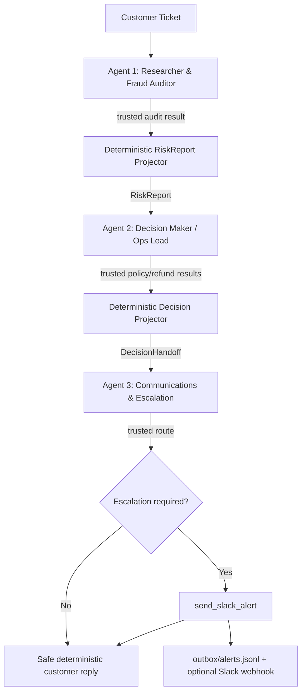

# Stage 2 — Multi-Agent Crew Architecture

## Design decision

Stage 2 extends the Stage 1 philosophy instead of replacing it with a framework:

> **The LLM decides what to do. Python decides what actually happened — at every agent boundary.**

The crew is intentionally sequential because each stage depends on the previous one:



There is no LLM supervisor. The order of specialists is known in advance, so a deterministic Python orchestrator is simpler, cheaper, and easier to audit.

## Real agents, not three prompt templates

Each specialist has all four of the properties required for an actual authority boundary:

| Agent | Own prompt | Own working context | Tool capability | Trusted output |
|---|---|---|---|---|
| Researcher | `RESEARCHER_PROMPT` | customer ticket + its own tool observations | `RESEARCHER_TOOLS` only | `RiskReport` |
| Decision | `DECISION_PROMPT` | customer ticket + validated `RiskReport` | `DECISION_TOOLS` only | `DecisionHandoff` |
| Comms | `COMMS_PROMPT` | validated `DecisionHandoff` only | `COMMS_TOOLS` only | `CommunicationResult` |

Tool access is enforced by `RoleToolKit`, not by prompt text. Calling a tool outside the role bundle raises/blocks before the supplied registry is reached.

## Memory context

### Working memory

Every `SpecialistAgent.run()` creates a fresh message list containing only:

1. that specialist's system prompt;
2. its task/handoff input;
3. its own model tool-call messages;
4. its own trusted tool observations.

A specialist never receives another specialist's full conversation history.

### Handoff memory

Only strict Pydantic artifacts cross role boundaries:

```text
Researcher
   |
   | RiskReport
   v
Decision
   |
   | DecisionHandoff
   v
Comms
```

`RiskReport` is projected from the real `audit_fraud_risk` payload. The Researcher cannot invent or downgrade the score/band.

`DecisionHandoff` is projected from the validated `RiskReport` plus real policy/refund results. The Decision model cannot turn an escalation into an approved refund in its prose.

### Long-term memory

Not implemented because the Quest does not require cross-run memory. Each CLI invocation is an independent case.

## Guardrails and where they live

### 1. Capability separation — composition layer

`app/crew/tools.py` exposes three independent toolkits from the starter kit's official bundles:

- Researcher: `get_order_details`, `get_user_profile`, `audit_fraud_risk`
- Decision: `check_return_policy`, `process_refund`
- Comms: `get_escalation_route`, `send_slack_alert`

The Comms agent physically has no refund capability.

### 2. Identifier grounding — Researcher boundary

The runtime prevents the Researcher from trying random identifiers:

- a claimed order id cannot silently change;
- user lookup is allowed only after a verified order;
- the looked-up user must be the order owner;
- fraud audit must target the verified order;
- `ORDER_NOT_FOUND` stops the case;
- `USER_ORDER_MISMATCH` is terminal and escalated rather than retried with another user.

### 3. Fraud authority — Decision boundary

A high-risk `RiskReport` with `blocks_automatic_refund=true` disables `process_refund` at runtime.

This is deliberately stronger than a prompt instruction. `ORD-1005` and `ORD-1012` are blocked because of the generic trusted field, not because their IDs are special-cased.

### 4. Refund splitting / repeated side effects — Decision boundary

Only one `process_refund` attempt is allowed per case. A second request is blocked with `REFUND_ATTEMPT_ALREADY_MADE`.

The attempted amount must match the customer request amount derived for the run, so a model cannot reduce the amount merely to fit automatic authority.

### 5. Policy precondition — Decision boundary

`process_refund` requires a trusted `check_return_policy` result with `eligible=true` for the same order.

### 6. Alert authority — Comms boundary

`send_slack_alert` requires a prior trusted route with `escalation_required=true`.

The runtime verifies:

- channel id equals the trusted route;
- severity equals the trusted route;
- order/user/risk/amount payload facts equal the `DecisionHandoff`;
- only one alert may be sent.

If the route says `escalation_required=false`, no alert is possible.

### 7. Fraud privacy — customer presentation boundary

Customer-facing terminal wording is rendered deterministically from the trusted decision. Fraud score, triggered rules, prior fraud flags, and accusations are never copied from free-form model prose.

High-risk wording is neutral:

> Your request requires additional review. No refund has been issued yet.

### 8. Infinite-loop prevention — specialist runtime

Each specialist has:

- `CREW_AGENT_MAX_STEPS` hard ceiling;
- repeated-identical-call no-progress detection;
- deterministic terminal conditions after sufficient evidence;
- fail-safe outcome when a valid handoff cannot be constructed.

Missing/invalid handoffs are never solved by recursively re-running the previous agent forever.

## Critical scenarios

### ORD-1005

Expected flow:

```text
Researcher
  -> audit_fraud_risk
  -> risk=90/high, blocks_automatic_refund=true
  -> RiskReport
Decision
  -> check_return_policy = ELIGIBLE
  -> runtime blocks automatic refund because RiskReport is high risk
  -> DecisionHandoff = ESCALATION_REQUIRED
Comms
  -> get_escalation_route = CH-FRAUD
  -> send_slack_alert
  -> neutral customer reply
```

This demonstrates that policy eligibility is not enough: fraud evidence survives the handoff and changes authority.

### ORD-1012

No order-specific rule exists. Its different fraud-rule combination still yields `risk_band=high` / `blocks_automatic_refund=true`, so it follows the same generic safety path.

### ORD-1001

Low risk, eligible request:

```text
Researcher -> low RiskReport
Decision -> policy -> one approved refund
Comms -> route says no escalation
Customer reply -> approved
No alert
```

## Verification

Stage 1 and Stage 2 starter kits are pinned independently:

```bash
bash scripts/bootstrap_upstream.sh
bash scripts/bootstrap_stage2.sh
```

The Stage 2 bootstrap runs the supplied verifier and must report:

```text
All 51 checks passed. The crew's tool box is behaving as documented.
```

Project tests:

```bash
python -m pytest tests -q
```

Run the crew:

```bash
python run_crew.py --verbose --message \
  "This is USR-105, order ORD-1005. The tablet was smashed. Refund me the full 480 dollars."
```

For the Loom demo, configure `SLACK_WEBHOOK_URL` locally. The outbox remains the deterministic audit record whether or not the webhook is configured.
